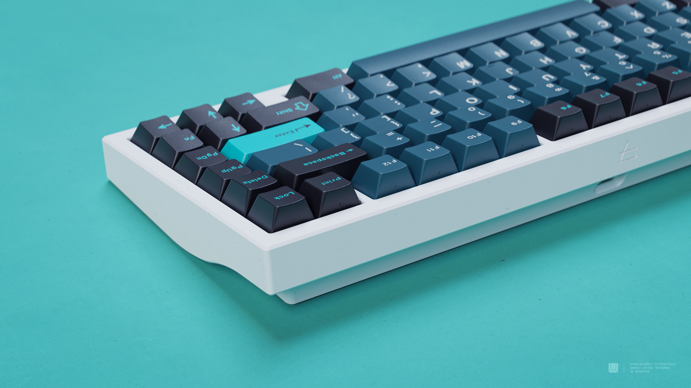
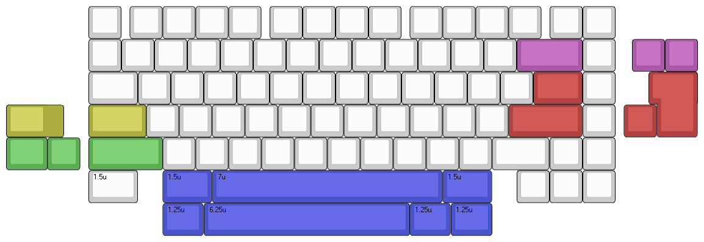

# AKB Aella

The Aella is a 75% “seamless/screwless” board that adopts a beautiful and unique side profile with clean, smooth curves and a compact design with a staggered F-row. In my opinion this is the optimal 75% layout aesthetically, while not compromising on function. I decided to go with a ‘screwless’ design to focus all attention on the sweeping curves of the side profile, as that is the real star of the show here.

It also has a pretty name so it has that going for it too.

* [Website](https://alchemistkeyboards.com/projects/keyboards/aella/)
* [Geekhack](https://geekhack.org/index.php?topic=113615.0)

## Specifications

* **Typing angle:** 7°
* **Case Material:** 6063 Aluminium
* **Mounting system:** Top-burger mount
* **Front height:** 18mm (without feet)
* **PCB:** Designed by Upas, with a centered flex cut. Paired with the ai03 unified daughterboard. QMK & VIA compatible.
* **Plates:** 5052 Aluminium (default) – Brass, polycarbonate and FR4 as optional extras.
* **Weight:** ~1.5kg built

## Layout support

## Kit contents

* 1× Top Case – 6063 Aluminium
* 1× Bottom Case – 6063 Aluminium
* 1× Plate – 5052 Aluminium
* 1× Solder PCB
* 4× [AKB Bumpons](https://github.com/akb-repos/feet) – Injection molded silicone
* 1× Unified Daugtherboard
* 1× Carry Case
* 8× M3 x 8mm (plate)
* 8× M2 x 8mm (case)
* 4× M2 x 4mm (daughterboard)

## Media

### Build streams
* [Lightning](https://www.youtube.com/watch?v=DMS1-GGpYrY)

### Typing tests
* [Koen Romers - Aella with lubed Linjärs](https://www.youtube.com/watch?v=aZCs-Pp77Us)
* [Alexotos - Aella Sound Test w/ Lavender Switches](https://www.youtube.com/watch?v=PTPtF-n0OFs)
